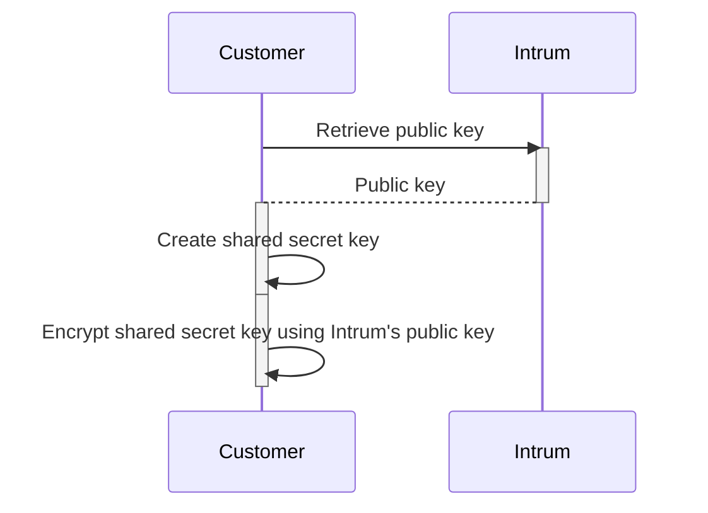

# Abonit REST API APIM

The EIRENE web service offers the option to perform creditworthiness checks. These checks are processed by forwarding the requests to the Intrum API.

To comply with data protection regulations, Intrum encrypts the results prior sending them back to the Post service.

Since the encryption key is negotiated directly between Intrum and the customer, the EIRENE service cannot access the contents of the credit check. Instead, the service simply forwards the encrypted data from Intrum to the customer without modifications.

## Sequence of key creation and data encryption

Before an address verification can begin, the customer generates a shared secret key that must be encrypted prior transmission to Intrum. The transmitted key will be used to encrypt the results generated by the Intrum API.

The first step of the process will the retrieval of Intrum’s public key, that will be used to encrypt the shared secret key.

A shared secret key is then generated by the customer using the **A**dvanced **E**ncryption **S**tandard. Please refer [here](https://en.wikipedia.org/wiki/Advanced_Encryption_Standard) for further insights about AES encryption standard.

In the last step the generated shared secret key will be encrypted using Intrum’s public key and stored on the customer’s side for the lifetime of the ERIENE request.

To prevent replay attacks the shared secret key must the renewed with each EIRENE request.