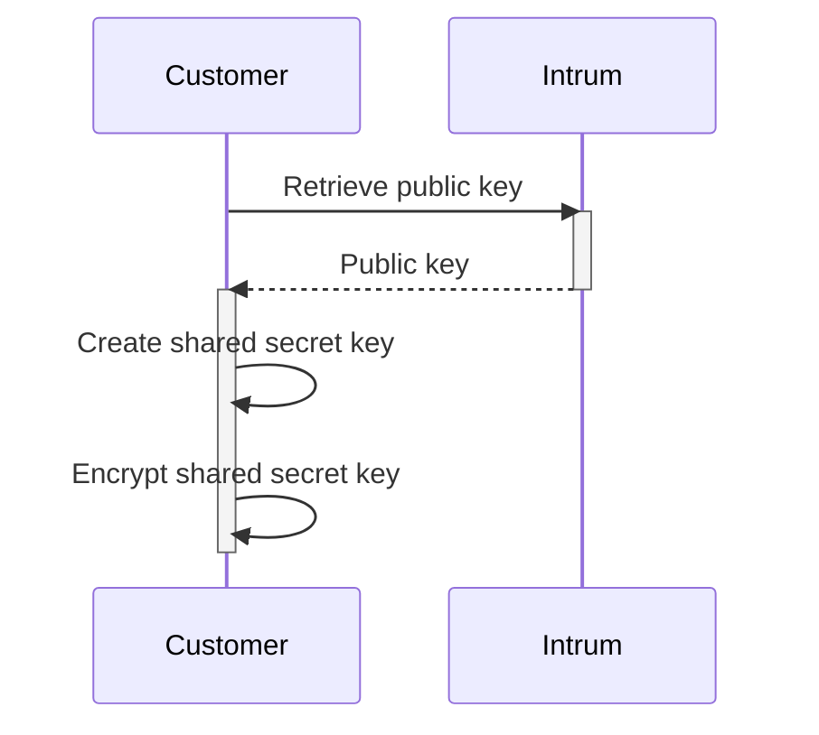
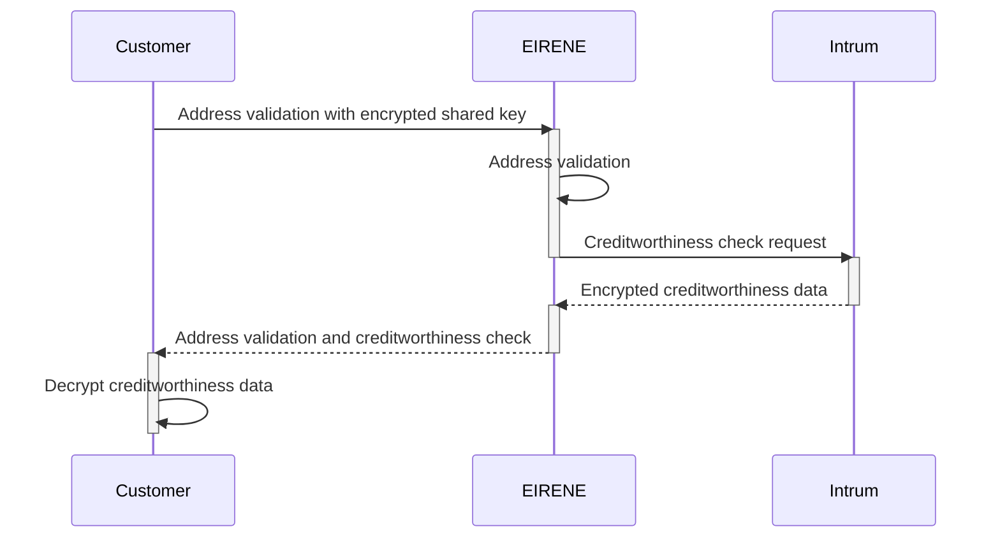

# Abonit REST API APIM

The EIRENE web service offers the option to perform creditworthiness checks. These checks are processed by forwarding the requests to the Intrum API.

To comply with data protection regulations, Intrum encrypts the results prior sending them back to the Post service.

Since the encryption key is negotiated directly between Intrum and the customer, the EIRENE service cannot access the contents of the credit check. Instead, the service simply forwards the encrypted data from Intrum to the customer without modifications.

## Sequence of key creation and data encryption

Before an address verification can begin, the customer generates a shared secret key that must be encrypted prior transmission to Intrum. The transmitted key will be used to encrypt the results generated by the Intrum API.



The first step of the process will the retrieval of Intrum’s public key, that will be used to encrypt the shared secret key.

A shared secret key is then generated by the customer using the **A**dvanced **E**ncryption **S**tandard. Please refer [here](https://en.wikipedia.org/wiki/Advanced_Encryption_Standard) for further insights about AES encryption standard.

In the last step the generated shared secret key will be encrypted using Intrum’s public key and stored on the customer’s side for the lifetime of the ERIENE request.

To prevent replay attacks the shared secret key must the renewed with each EIRENE request.

## Address maintenance with creditworthiness check

The customer sends a request to EIRENE, providing the address data, the type of comparison, and the encrypted shared secret key.

EIRENE processes the address verification.

The EIRENE results, including the encrypted shared secret key for the creditworthiness check, are forwarded to the Intrum service.

Intrum performs the creditworthiness check, encrypts the results, and hands them back to the EIRENE service.

EIRENE then attaches the creditworthiness check results to it's own calculations and transmits the extended package back to the customer.

The customer then decrypts the results using their key and utilizes the information as needed.



## Encrypt shared secretkey and data decryption

The process for creating and encrypting a shared secret key, including a reference implementation, can be found at the following [link](https://docs.mideal.io/dev/data-check-api/data-check-api-with-encrypted-result). This link also provides instructions on how to decrypt the creditworthiness data.

Intrum public key URLs:
- Test [https://sandbox-autoid.ubiid.ch/api/v1/public/credit-information/public-key](https://sandbox-autoid.ubiid.ch/api/v1/public/credit-information/public-key)
- Production [https://autoid.ubiid.ch/api/v1/public/credit-information/public-key](https://autoid.ubiid.ch/api/v1/public/credit-information/public-key)

## EIRENE REST API

The EIRENE REST API is provided by the API management platform of Post and can be found searching for **Address query Webservice**

EIRENE REST API by environment
- Test [https://developer.apis-test.post.ch/ui/apis](https://developer.apis-test.post.ch/ui/apis)
- Production [https://developer.apis.post.ch/ui/apis](https://developer.apis.post.ch/ui/apis)

Refer to the **POST** endpoint with URL **/creditworthiness/queries**.

### Request

The request expects a JSON body

```json
{
    "encryptedSecretKey": "ENCRYPTED_KEY",
    "alignmentType": "QUERY_KEY",
    "timeOutSecond": 10000,
    "address": [
        {
            "field": "Prename_in",
            "value": "Hans"
        },
        {
            "field": "Name_in",
            "value": "Muster"
        },
        {
            "field": "StreetName_in",
            "value": "Sternmatt"
        },
        {
            "field": "HouseNo_in",
            "value": "6"
        },
        {
            "field": "ZIPCode_in",
            "value": "6010"
        },
        {
            "field": "TownName_in",
            "value": "Kriens"
        }
    ]
}
```

| Element | Type | Description |
| -------- | ------- | ------- |
| encryptedSecretKey | string | The encrypted shared secret key |
| alignmentType | string | Key that identifies the query to be executed |
| timeOutSecond | int | Timeout int ms |
| field | string | Name of the field |
| value | string | Value of the field |

### Response

The response is a JSON document structed as

```json
{
    "creditworthinessInfo": {
        "cipherText": "CIPHERTEXT",
        "associatedData": "ASSOCIATEDDATA"
    },
    "settlementId": "10777557",
    "result": [
        {
            "field": "Prename",
            "value": "Hans"
        },
        {
            "field": "Name",
            "value": "Muster"
        },
        {
            "field": "StreetName",
            "value": "Sternmatt"
        },
        {
            "field": "HouseNo",
            "value": "6"
        },
        {
            "field": "ZIPCode",
            "value": "6010"
        },
        {
            "field": "TownName",
            "value": "Kriens"
        }
   ]
}
```

#### Field **creditworthinessInfo***

Contains the encrypted response (cipherText) and associated data (associatedData) provided by Intrum's API.

Keep in mind these fields are **Base64** encoded.

#### Field **settlementId**

Billing identifier assigned by EIRENE.

#### Field **result**

Contains the individual elements of the validated address and the status of the query.

#### Field **creditWorthinessInfo**

Intrum queries the Credit Information module for the creditworthiness check. Based on Intrum's manual the data contained in the response:

| ccsNum | ccsAlpha | Description  |
|--------|----------|--------------|
| 6      | A        | Very good    |
| 5      |          |              |
| 4      | B        | Good         |
| 3      |          |              |
| 2      |          |              |
| 1      | C        | Neutral      |
| 0      |          |              |
| -1     |          |              |
| -2     | D        | Bad          |
| -3     |          |              |
| -4     |          |              |
| -5     | E        | Very Bad     |
| -6     |          |              |
|        | M        | Minor        |
|        | X        | Not Known    |
|        | Z        | Deceased     |